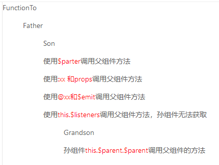
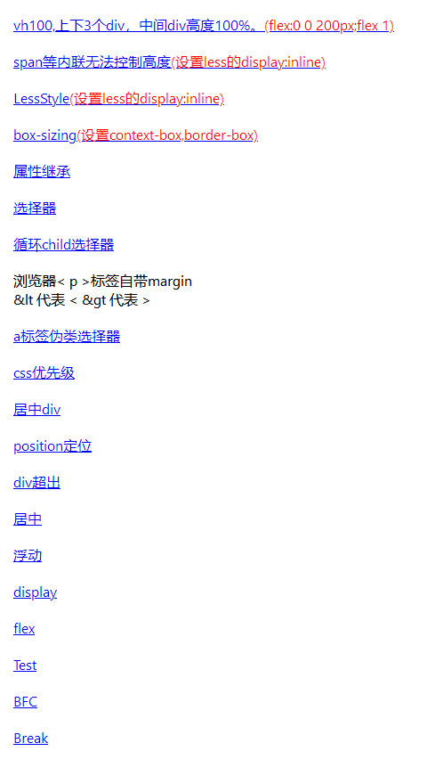
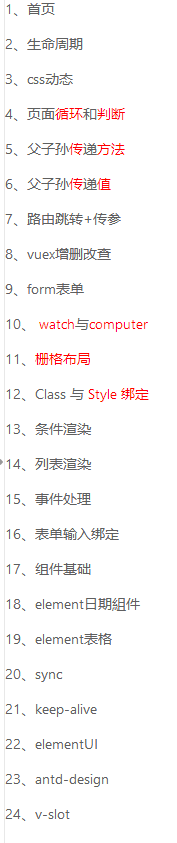

# shiyan
1、react的hooks之后版本、vue2.0初始项目  
 - 用于react两个版本、vue2.0生命周期；
 -
 - 父组件传给子组件值；
 - 子组件传给父组件值；
 - 父组件传给子组件方法；
 - 子组件传给父组件方法；
 - 父组件传给孙组件值；
 - 孙组件传给父组件值；
 - 父组件传给孙组件方法；
 - 孙组件传给父组件方法；
 - 
 - 如何动态设置class；
 - 绑定事件传值；
 - 循环；
 - 条件判断
 -
 - computed与watch与$watch

2、elemeUI  
- 用于实验antdegin和elemeUI的组件功能。  
  > aaa
  >> bbb

antdUI
*3、css实验室  

*4、js实验室

